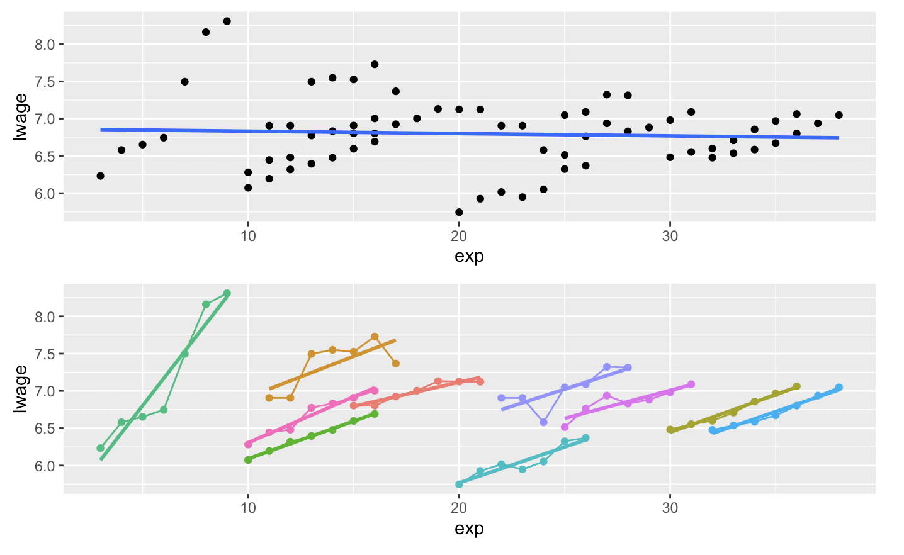
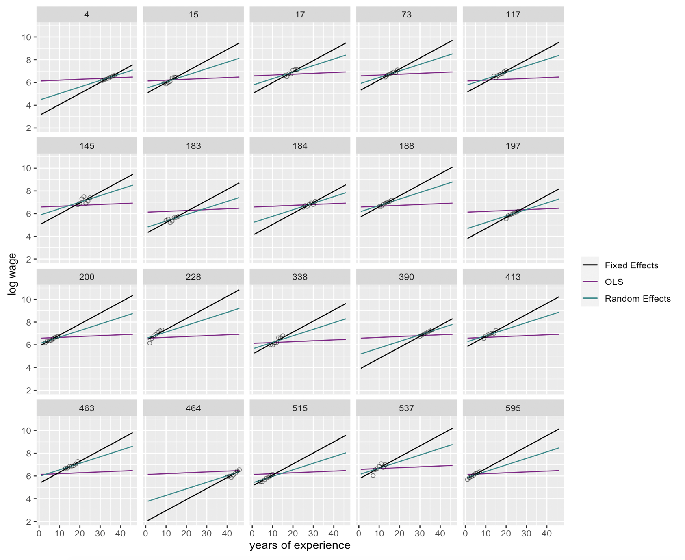

<style type="text/css">

body{ 

    font-size: 16px;
    line-height: 1.7em;
    <!-- text-align: justify; -->

}

blockquote {
    padding: 10px 20px;
    margin: 0 0 20px;
    font-size: 16px;
    border: solid 1px;
}

h1 { font-size: 32px; }

h2 { font-size: 24px; }

h3 { font-size: 20px; }

</style>

<br>

---

## Logistics & Announcement  

* PS3 (NYU Classes > Resources > Assignments > ps3) due on April 17th
* Replication project check-up: Questions? Issues? 

|         Task                       |  Timeline          |
|------------------------------------|--------------------|
| Obtaining the raw data from IPUMS  | By Mar. 29th       |
| Cleaning the data                  | Mar. 29th to Apr. 11th   |
| **Replicating Table A1a, Table A1b, and Figure 1 and put in LaTeX** | **Apr. 12th to Apr. 25th**  |
| Replicating regression and report in Table A2a, Table A2b and put in LaTeX | Apr. 26th to May 9th |
| Write the 2-page project report + Wiggle room for formatting and debugging, etc. | May 10th to May 14th |  

* Last two labs: Please fill out [this anonymous survey](https://nyu.qualtrics.com/jfe/form/SV_5bFlkv5phi6J5D8) to let me know what you prefer to cover for the last two sessions. 

```{r setup, include=FALSE}
knitr::opts_chunk$set(echo = TRUE)

library(pacman)
p_load(tidyverse, stargazer, kableExtra, gridExtra, plm, effects)

```

## Part 1 Panel Data Structure 

  For today's lab, we will use a dataset `Wages` provided by the R package `plm`. This is a panel of 595 individuals from 1976 to 1982, taken from the Panel Study of Income Dynamics (PSID).  
  
  For the purpose of demonstration, this panel data is already organized in the tidy "long-format" with every person-year observation saved in each row. In addition, there is no missing data. (In practice you probably will perform data cleaning before having a dataset as clean and tidy as we have here.)  
  
  Now, load the data into your R environment. Look at the data carefully and answer the following questions:  
  
  (1) Over how many time points were these individuals followed?  
  
  (2) Which variables vary over time and which variables don’t? (Hint: Type `?Wages` in Console or search "Wages" in the Help tab.)
  
```{r }

# load data into the environment
data(Wages, package = "plm")

```

  Note that this dataset does not contain a person identifier or a year variable, which are usually helpful and necessary variables for analysis. We can add these two variables to the dataframe using the `mutate` function.  
  
```{r }

Wages_clean <- Wages %>%
        # Add person ID: genearte a number sequence from 1 to 595, 
        # each number repeats for numbers of observation in the panel 
  mutate(pid = rep(1:595, each = nrow(Wages)/595),
        # Add year: generate a number sequence from 1976 to 1982, 
        # and repeat this sequence for 595 times
         year = rep(1976:1982, times = 595))

```

---

### Part 1 Exercise 

Before estimating models, let's create some descriptive plots for exploratory purposes. Suppose we are interested in the relationship between **years of full-time work experience** and **wage**. Replicate the the plot below following the listed steps. This plot contains two panels, with one illustrating the aggregate relationship and the other the individual-level trajectories.
  
{width=60%}  

  1. Sample ten persons from the dataset;
  2. Create an "aggregate trend" scatter plot of these individuals across all observation years with an OLS regression line for the variable `exp` and `lwage` (the upper panel);
  3. Similarly, create an "individual trend" scatter plot (the lower panel);
  4. Arrange the two plots using `grid.arrange()`, post your plot to Slack;
  5. How does the relationship between `exp` and `lwage` differ in these two plots? What would be the possible reasons for the difference?   
  
  Note: Due to sample randomness, it is okay if your plot looks different from the example. It is also fine if your plot has legends. 

```{r }

# Your code here

```

---

  In addition to a simple bivariant relationship, we can further explore how the microlevel wage trajectories vary by gender. For the purpose of demonstration, we can sample 10 individuals from each gender group, and plot their wage trajectories. 
  
```{r , message=F}  

# Sample pid by gender
set.seed(930412)
pid_bysex <- Wages_clean %>%
  distinct(pid, .keep_all = T) %>%
  group_by(sex) %>%
  sample_n(10) %>%
  ungroup() %>%
  pull(pid)

# Aggregate trend
fig3 <- Wages_clean %>%
  filter(pid %in% pid_bysex) %>%
  ggplot(aes(x = exp, y = lwage, color = sex, group = sex)) +
  geom_point() +
  geom_smooth(method = "lm", se = F, size = 0.5) +
  labs(title = "Scatterplot with OLS Line, by Gender")

# Look at individual trend
fig4 <- Wages_clean %>%
  filter(pid %in% pid_bysex) %>%
  ggplot(aes(x = exp, y = lwage, color = sex, group = as.factor(pid))) +
  geom_point() +
  geom_smooth(method = "lm", se = F, size = 0.5) +
  labs(title = "Scatterplot with OLS Line, by PID and Gender")

grid.arrange(fig3, fig4)

```

## Part 2 Fixed Effects and Random Effects Models

  As you may have observed, the relationship between work experience and log wage revealed by the two different estimation approaches are quite different. In general, the OLS model estimated on the aggregate data gives a much smaller slope than OLS estimated by each individual's wage trajectory. We might even run into the Simpson's paradox, where the OLS model slope of the aggregate data is negative, whereas the OLS model slopes of the individual trends are mostly positive (as shown in the example graph in Part 1 Exercise).  
  
  Once we look into the **within-individual** relationship between the outcome and the predictor, we see that a simple OLS model's predictions are not really in line with the data. This is also expected as there is a lot of **between-individual heterogeneity in the trends, which we cannot capture when we pool across all observations**.
  
  Therefore, when analyzing time-series and nested data, we use different modeling strategies that take into account the data structure. In this lab we will cover the fixed effects and random effects models.  
  
### 2.1 Fixed Effects Models  

  First, fixed effects models **add a source of between-individual heterogeneity to the model**, while assuming that the slope remains the same across individuals. This leads us to the equation:

$$Y_{it} = \alpha + X_{it}\beta + \eta_i + \epsilon_{it},$$

where $\eta_i$ is a **time-invariant, individual-specific** term that helps us control for unchanging characteristics of the individual that are either measured or unmeasured that have additive effects on $Y_i$.  

  You can think of $\eta_i$ as an individual-specific shift in the intercept. That is, the intercept for individual $1$ would be $\alpha_1 = \alpha + \eta_1$, that for individual $2$ would be $\alpha_2 = \alpha +\eta_2$, and that for individual $i$ would be $\alpha_i = \alpha + \eta_i$. So we could rewrite the model as (notice the new subscript on $\alpha_i$)

$$Y_{it} = \alpha_i + X_{it}\beta + \epsilon_{it}.$$

  One way to fit separate intercepts for each individual in longitudinal data is simply include $n - 1$ dummy variables into our model. Or you can fit a fixed effects model in R directly using specific functions. This model, with individual-specific intercepts, is what people call the **fixed effects model**.

### 2.2 Random Effects Models

  Fixed effects and random effects models differ mainly in their assumption regarding the behavior of $\eta_i$. Let us return to the equation: 

$$Y_{it} = \alpha + X_{it}\beta + \eta_i + \epsilon_{it}.$$

  In the fixed effects model, $\eta_i$ was treated as **a fixed parameter** of the model: it's a fixed number we want to estimate. 

  On the other hand, in the random effects model we assume that $\eta_i$ is **a random variable**, so it will have an expected value and a variance.  
  
  Random effects models assume that the "random effect" ($\eta_i$) is not correlated with the within-individual error term. Further, it is assumed that $\eta_i$ has a mean of zero and a constant variance. Usually, we also assume that $\eta_i$ follows a Normal distribution: $\eta_i \sim \text{Normal}(0, \sigma_\eta^2)$

  Hence, similar to $\epsilon_{it}$, $\eta_i$ is treated as a random disturbance around the conditional mean of $Y_{it}$ with variance $\sigma_\eta^2$, where the only difference is that $\eta_i$ **is varying across individuals but not within them**.  

### 2.3 Estimating Models in R

  To estimate fixed effects and random effects models in R, we use the `plm` package. For fixed effects models, as we have mentioned earlier, you can also fit a simple linear model with "person dummies" -that is, for $n$ unique persons, create $(n-1)$ dummy variables (you can do this using `as.factor(person_id)` when you estimate the model).  
  
  For example, we want to estimate a model predicting mean log wage using years of working experience and gender. Think about your modeling setup: For the fixed effects and random effect models, what variables will be included? How are these two models different in their setup? Why? 

```{r }

# Simple OLS model (for purpose of comparison)
m_ols <- lm(lwage ~ exp + sex, data = Wages_clean)

# Fixed effects model -using person dummies
m_fe_dummy <- lm(lwage ~ exp + as.factor(pid) , data = Wages_clean)

# Fixed effects model -using plm package
# model = "within" indicates fixed effects model
# index = c("pid") is the grouping variable in your fixed effects model
m_fe <- plm(lwage ~ exp, data = Wages_clean, model = "within", index = c("pid"))

# Random effects model -using plm package
m_re <- plm(lwage ~ exp + sex, data = Wages_clean, model = "random", index = c("pid"))

# Display modeling results 
stargazer(m_ols, m_fe, m_re, type = "text", omit.stat = c("f", "ser"))

# You can also compare the coefficients of your person dummy linear model and your fixed effects model
# R-square of fixed effects model is different from OLS model! https://stats.stackexchange.com/questions/401264/which-r-squared-value-to-report-while-using-a-fixed-effects-model-within-betw
```


### 2.4 Plot Predicted Effects
  
  Let us compare the results of the fixed effects model and the random effects model by plotting the predicted log wage by the predictors. For demonstration purposes, we will use the gender-balanced sample ($n = 20$) obtained earlier.  
  
```{r }

# Save a subsample of the gender-balanced 20 individuals sampled earlier 
Wages_sample <- Wages_clean %>%
  filter(pid %in% pid_bysex) %>%
  dplyr::select(pid, lwage, sex, exp)
# A df that match pid with gender
sample_gender_key <- Wages_sample %>%
  dplyr::select(pid, sex) %>%
  distinct(pid, .keep_all = T)

# Find the range of experience in the subsample
summary(Wages_sample$exp)
# min = 1, max = 46

# Create a number sequence for years of experience
exp_seq = seq(1, 46, 1)

# --------- predicted effect of the fixed effects model -----------

# Create a IV df with pid and years of experience based on the subsample
IV_fe <- tibble(
  # each pid will repeat for 46 times for each value of exp
  pid = rep(pid_bysex, each = length(exp_seq)),
  # the exp seq will repeat 20 times so that it matches with 20 pid
  exp = rep(exp_seq, times = 20)
  )

# Get predicted Y using the OLS dummy model
yhat_fe <- predict(m_fe_dummy, newdata = IV_fe, interval = "confidence")

# Combine results
predict_fe <- cbind(IV_fe, yhat_fe) %>%
  left_join(sample_gender_key, by = "pid")
  

# Plot predicted effect, with original subsample's scatterplot
fig_fe <- ggplot() +
  # Observed scatterplot
  geom_point(aes(x = exp, y = lwage, color = sex), data = Wages_sample) +
  # Connecting observed dot with dashed lines
  geom_line(aes(x = exp, y = lwage,  group = as.factor(pid), color = sex), 
            linetype = "dashed", data = Wages_sample) +
  # Fixed effect model curves
  geom_line(aes(x = exp, y = fit, group = as.factor(pid), color = sex), 
            size = 0.2, data = predict_fe) +
  ylim(2, 12) +
  labs(title = "Predicted Wage (Fixed Effects)",
       x = "Years of Full-time Work Experience", 
       y = "Log_e(Wage)") + 
  theme(legend.position = "bottom")


# --------- predicted effect of the random effects model -----------

# dataset to make predictions
IV_re <-  tibble(
    pid = rep(pid_bysex, each = length(exp_seq)),
    exp = rep(exp_seq, times = 20)
) %>%
  left_join(sample_gender_key, by = "pid")

# here predictions are based on alpha + X_{it}\beta
yhat_temp_re <-  predict(m_re, newdata = IV_re)
    
# predict eta using `ranef` function
eta_re <- ranef(m_re) %>%
  cbind(pid = as.numeric(names(.)), 
        eta = .) %>%
  as.data.frame() %>%
  filter(pid %in% Wages_sample$pid)

# merge predicted eta_i to tmp_rand
predict_re <- cbind(IV_re, yhat_temp_re) %>%
  left_join(eta_re, by = "pid") %>%
  # add eta_i to alpha + X_{it}\beta
  mutate(yhat_re = yhat_temp_re + eta)

# Plot
fig_re <- ggplot() +
  geom_point(aes(x = exp, y = lwage, color = sex), data = Wages_sample) +
  geom_line(aes(x = exp, y = lwage,  group = as.factor(pid), color = sex), 
            linetype = "dashed", data = Wages_sample) +
  geom_line(aes(x = exp, y = yhat_re, group = as.factor(pid), color = sex), 
            size = 0.2, data = predict_re) +
  ylim(2, 12) +
  labs(title = "Predicted Wage(Random Effects)",
       x = "Years of Full-time Work Experience", 
       y = "Log_e(Wage)") + 
  theme(legend.position = "bottom")

# Combine plots
grid.arrange(fig_fe, fig_re, ncol = 2)
```


```{r, fig.width=10, fig.height=6}

# --------- predicted effect of the OLS model -----------
predict_ols <- Effect(
  # Key IVs for which you examine the predicted effects
  c("sex", "exp"),   
  m_ols,
  # Values of IVs
  xlevels = list(
    sex = c(replicate("female", n = length(exp_seq)), 
            replicate("male", n = length(exp_seq))),
    exp = rep(exp_seq)
    ),
  # Set confidence intervals
  confidence.level = .95) %>%
  # Convert to dataframe
  as.data.frame()

# Plot
fig_ols <- ggplot() +
  geom_point(aes(x = exp, y = lwage, color = sex), data = Wages_sample) +
  geom_line(aes(x = exp, y = lwage,  group = as.factor(pid), color = sex), 
            linetype = "dashed", data = Wages_sample) +
  geom_line(aes(x = exp, y = fit, color = sex), size = 0.2, data = predict_ols) +
  ylim(2, 12) +
  labs(title = "Predicted Wage(OLS)",
       x = "Years of Full-time Work Experience", 
       y = "Log_e(Wage)") +
  theme(legend.position = "bottom")

# Combine plots
grid.arrange(fig_ols,  
             fig_fe, 
             fig_re,
             ncol = 3)

```

Notice that the intercept for the random effects model lies always between the the intercept for the OLS model and the fixed effects model. This is the expected behavior which might be roughly explained by the random effects model setup in which we assume that the individual-level error term $\eta_i$ follows a Normal distribution. This means that we are assuming that the individual-specific intercepts ($\alpha_i$)  are randomly varying around a grand mean ($\alpha$) according to a bell-shaped curve. If the variance of $\eta_i$ is small, this is unlikely that the estimates of the individual-specific intercepts are far away from the grand mean. Our estimates for the $\alpha_i$ will therefore be "shrunk" towards the grand-mean ($\alpha$). 

---

### Part 2 Exercise

Try to recreate the figure below that demonstrates the three different model curves by each individual's pid. Make sure that you run all the code chunks before this question to ensure you have necessary objects in your R environment. Then, to simplify the steps, you can create a dataframe that is ready for plotting using the code provided in the following code chunk. 

{width=70%}

```{r }

# Prepare df for combining
predict_fe_temp <- predict_fe %>% 
  dplyr::select(pid, exp, sex, fit) %>%
  rename(yhat_fe = fit)

predict_re_temp <- predict_re %>% 
  dplyr::select(pid, exp, sex, yhat_re)

predict_ols_temp <- predict_ols %>% 
  dplyr::select(exp, sex, fit) %>%
  rename(yhat_ols = fit)

# Combine yhat of three models
predict_combine <- predict_fe_temp %>%
  full_join(predict_re_temp, by = c("pid", "exp", "sex")) %>%
  left_join(predict_ols_temp, by = c("exp", "sex")) %>%
  left_join(Wages_sample, by = c("pid", "exp", "sex"))

```

Your code for plotting below:

```{r }

# Your code here


```


