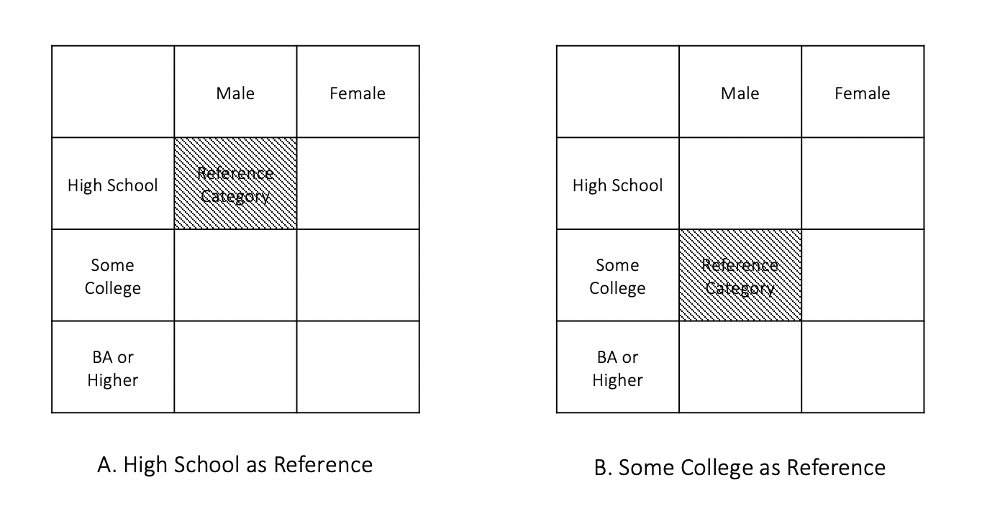
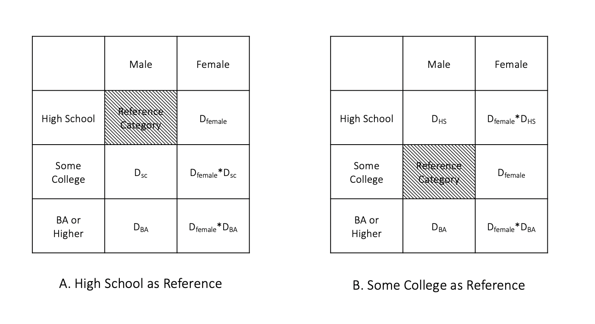

<style type="text/css">

body{ 

    font-size: 16px;
    line-height: 1.7em;
    <!-- text-align: justify; -->

}

blockquote {
    padding: 10px 20px;
    margin: 0 0 20px;
    font-size: 16px;
    border: solid 1px;
}

h1 { font-size: 32px; }

h2 { font-size: 24px; }

h3 { font-size: 20px; }

</style>

<br>

---

## Logistics & Announcement

* Still grading PS2... Will return them next week.  

* PS3 will be distributed on March 29th and will be due on Apr.17th. PS4 will be distributed on April 19th and will be due on May 8th. The final replication project is due on Friday May 14th at 4pm.  

* For the final replication project, you should get started on downloading data from IPUMS and cleaning it for descriptive statistics and regression modeling. A rough timeline should be something like this: 

|         Task                       |  Timeline          |
|------------------------------------|--------------------|
| Obtaining the raw data from IPUMS  | By Mar. 29th       |
| Cleaning the data                  | Mar. 29th to Apr. 11th   |
| Replicating Table A1a, Table A1b, and Figure 1 and put in LaTeX | Apr. 12th to Apr. 25th  |
| Replicating regression and report in Table A2a, Table A2b and put in LaTeX | Apr. 26th to May 9th |
| Wiggle room for formatting and debugging, etc. | May 10th to May 14th |
  
  * Note that the above steps can be iterative. Sometimes you may find out that your raw data misses some important variables and needs to be extracted again. You may also find that your replicated results are very different from the authors due to coding mistakes in the data cleaning step and need to go back to that.  
  
  * Also, note that the tables and figures you replicated need to be **reported using LaTeX** (either via Overleaf or other LaTeX document generator). Formatting in LaTeX can be time-consuming, too.  
  
  * So please start early and take advantage of the time you have at this point!
  
  * For PS3 and PS4, I will include questions for the replication project as a guidance for your pacing, but those will not be graded as part of the assignment since they will be part of your final replication project.

  * Since next week's lab, we can devote some time for the replication project if you think it will be helpful? We can discuss this in next week's lab when you get started in data cleaning.

```{r setup, include=T, message=F}
knitr::opts_chunk$set(echo = TRUE)

library(tidyverse)
library(stargazer)

```

## Part 1: Interaction with Dummies of More Than Two Categories (Exam 3 Q1e)

The first question of Exam 3 aims to understand how gender and education predicts the programming intensity score of an individual's job. Question 1(e) states that:  

  (e) (4pts) Now, suppose you are interested in whether the gender gap in programming intensity score differs by education. **You will focus on the 2015 data for this question**.  

  Education is measured as a categorical variable that contains three categories, represented by three dummies: (1) high school or less ($D_\text{HS}$); (2) some college ($D_\text{SC}$); (3) BA or higher ($D_\text{BA}$).  

  Suppose you want to test **whether the gender gap differs between *those with some college* and *those with BA or higher* **, write down the regression equation that allows you to test this, and indicate which coefficient in this equation you will focus on. (HINT: Be sure to use the appropriate reference group in your regression.)  
  
  * First of all, since we only focus on the 2015 data, we no longer need the YEAR dummy in the regression equation for this question.   
  
---
  
### Part 1 Exercise 1

  1. Now, suppose that we do NOT consider the interaction effect of gender and education (i.e. the effect of education will not vary by gender and vise versa), write down TWO regression equations that predicts the programming intensity score by gender and education level using (A) Male and $D_\text{HS}$ as the reference, and (B) Male and $D_\text{SC}$ as the reference.
  
  {width=60%}
    
  2. For equation (A), write down the gender gap for individuals with (i) high school, (ii) some college, and (iii) BA or higher education.
  
  3. For equation (B), write down the gender gap for individuals with (i) high school, (ii) some college, and (iii) BA or higher education.
  
  4. What is the difference in predicted gender gap for people with Some College vs. people with BA or Higher education? 
  
---


  * Suppose we now allow the effect of education to vary by gender, that is, we allow interaction between gender and education level in the regression equation, we need to make sure that **the interaction terms include all the possible interactions between the two dummy variables while excluding the reference categories**, as shown the in the graph below. 
  
  
  {width=60%}
  
  
---

### Part 1 Exercise 2  

  1. **Allowing the interaction between gender and education level**, write down TWO regression equations that predicts the programming intensity score by gender and education level using (A) Male and $D_\text{HS}$ as the reference, and (B) Male and $D_\text{SC}$ as the reference.
  
  2. For equation (A), write down the gender gap for individuals with (i) high school, (ii) some college, and (iii) BA or higher education.
  
  3. For equation (B), write down the gender gap for individuals with (i) high school, (ii) some college, and (iii) BA or higher education.
  
  4. Looking at your results for Q2 and Q3, which equation set up can help you answer 1e in exam 3? Why? What is your take away for choosing the reference group for interactions with dummy variables? 
  
---

## Part 2: Causality: The Naive Estimation of the Average Treatment Effect and Selection Bias


### The Fundamental Problem of Causal Inference

  "Causal effects are defined by contrasts within rows, which refer to groups of individuals observed in the treatment state or in the control state. However, only the diagonal of the table is observable, thereby rendering impossible the direct calculation of individual-level causal effects merely by means of observation and then subtraction." (Morgan and Winship:45-6) 

Group                     |     $Y^T$            |   $Y^C$
--------------------------|----------------------|----------------------
Treatment Group ($D = 1$) | Observable as $Y$   |   Counterfactual 
Treatment Group ($D = 0$) | Counterfactual       |   Observable as $Y$


### Naive Estimation of the Average Treatment Effect

At the population level, the **average treatment effect (ATE)** is defined as:

$$E[\Delta] = E[Y^T - Y^C] = E[Y^T] - E[Y^C]$$

Since we do not observe the population level $Y^T$ or $Y^C$, the naive approach to estimate the population level ATE uses the following equation:

$$\hat E[\Delta]_\text{NAIVE} = E[Y^T|D = 1] - E[Y^C|D = 0]$$
  
  which calculates the difference in the expected value of $Y$ in the observed treated group ($E[Y^T|D = 1]$) and the expected value of $Y$ in the observed control group ($E[Y^C|D = 0]$).  
  
  This will hold **if assignment to treatment is purely random**.  

### Selection Bias
  
  However, if there are selection bias that lead to certain kinds of unit to go into the treatment or control group, the naive estimator will be biased.  
  
  This is due to the fact that this additional factor is related to both assignment to treatment and the potential outcome.  
  
  For example, if family income both affects the likelihood of a child going to a high quality school AND one's likelihood to be unemployed in adulthood, using the naive estimation of ATE will lead us to **overstate** the effect of school quality in reducing unemployment because those in the treated group will have a lower potential outcome (unemployment risk) then the control group *even if they are not treated*.

As covered in the lecture, we can decompose the naive estimator to:

<<<<<<< HEAD
$$\hat E[\Delta]_\text{NAIVE} = E[Y^T|D=1] - E[Y^C|D=1] + E[Y^C|D=1] - E[Y^T|D=0]$$
where $E[Y^T|D=1] - E[Y^C|D=1]$ is the **treatment effect on the treated** and $E[Y^C|D=1] - E[Y^C|D=0]$ is the **selectio bias** (you can think of as the effect of the treatment on the observed control group -units failed to be selected to receive the treatment).
=======
$$\hat E[\Delta]_\text{NAIVE} = E[Y^T|D=1] - E[Y^C|D=1] + E[Y^C|D=1] - E[Y^C|D=0]$$
where $E[Y^T|D=1] - E[Y^C|D=1]$ is the **treatment effect on the treated** and $E[Y^C|D=1] - E[Y^C|D=0]$ is the **selectio bias** (you can think of as the baseline difference of $Y$ if both the treatment and the control group are not treated).
>>>>>>> upstream/main

Although in the real world, we cannot observe the counterfactuals, we can simulate data that suffers from the selection bias problem and calculate the counterfactual $E(Y)$ for both $E[Y^T|D=0]$ and $E[Y^C|D=1]$, and thus obtain the native estimator, the treatment effect on the treated, and the selection bias.  

>*Additional note on the notation* (See Morgan and Winship:54-8)  
1. The notations $D = 1$ and $D = 0$ tell us whether we are looking at the (actual) treatment or the control group. Whereas the notations $Y^T$ and $Y^C$ are the realized values of $Y$ if one gets treated ($Y^T$) or one does not get treated ($Y^C$).  
2. Therefore, in the decomposed naive estimator of the ATE, the **treatment effect on the treated** (ATT) part means: The difference in the expected $Y$ between (i) if people in the current treatment group ($D = 1$) get treated ($E[Y^T|D=1]$), which is observed, and (ii) if people in the current treatment group ($D = 1$) did not get treatment ($E[Y^C|D=1]$), which is the counterfactual.  
3. Whereas the **selectio bias** part means: The difference in the expected $Y$ between (i) if the current control group ($D = 0$) did not get the treatment ($E[Y^C|D=0]$), which is observed, and (ii) if the current treatment group ($D = 1$) also did not get the treatment ($E[Y^C|D=1]$), which is counterfactual. That is, **the baseline difference of $Y$ if both the treatment and the control group were not treated.**  
4. There is also a definition of the **treatment effect on the control** (ATC), which can be expressed as $E[Y^T|D=0] - E[Y^C|D=0]$. This means: The difference in the expected $Y$ between (i) if people in the current control group ($D = 0$) get treated ($E[Y^T|D=0]$), which is the counterfactual, and (ii) if people in the current control group ($D = 0$) did not get treated ($E[Y^C|D=0]$), which is observed. 

Following the example given in Q2 in Exam 3, let us simulate a data that has family income as a confounder for the relationship between school quality and adulthood unemployment.  


```{r }

# --------- Simulate First IV: Family income ---------
# Simulate a distribution of family income (in 1,000 dollar)
# random beta distribution for skewed distribution
set.seed(5678)
family_income <- 20*rbeta(1000, 2, 10) 

# Check distribution
hist(family_income) 


# --------- Simulate Second IV: School Quality Dummy ---------
# Simulate a dummy variable for high vs. low shool quality

# The probability of going to a high quality school (Dummy = 1) 
# is a linear increasing function of familty income
prob_of_high_q_sch <- (2 + scale(family_income))/7

# # Check the relationship btw family income and prob of high q sch
# tibble(prob_of_high_q_sch = prob_of_high_q_sch,
#        family_income = family_income) %>%
#   ggplot() +
#   geom_point(aes(family_income, prob_of_high_q_sch))

# Simulate the dummy variable for school quality (high = 1, low = 0)
set.seed(5678)
school_quality_dummy <- rbinom(1000, 1, prob_of_high_q_sch)


# --------- Simulate DV: Adult Unemployment ---------
set.seed(5678)
# An unemployment risk index
unemp <- 17 - 0.3*school_quality_dummy - 0.5*family_income + rnorm(1000, 0, 2)
# Check distribution
hist(unemp)


# --------- Create a Df of Simulated Data ---------
unemploy_df <- tibble(
  fam_inc = family_income,
  sch_high_q = school_quality_dummy,
  unemp = unemp
)

head(unemploy_df, 5)

```


  To obtain the counterfactual $E[Y^T|D=0]$ and $E[Y^C|D=1]$, we need to generate the individual level $y_i^T|D=0$ and $y_i^C|D=1$.  
  
  First, we can generate a counterfactual treatment state variable `sch_counterf` that equals to the opposite of the original school quality dummy `sch_high_q`.  
  
  Second, we can calculate a counterfactual unemployment index value using the same prediction equation as we simulate the DV earlier, just replace the original treatment dummy `sch_high_q` with the counterfactual treatment dummy `sch_counterf`. In other words, we generate the counterfactual DV for each individual by holding their family income as the same as before, but altering the quality of school dummy. 

```{r }
# --------- Add counterfactual variables---------
unemploy_df <- unemploy_df %>%
  mutate(sch_high_q_counterf = ifelse(sch_high_q == 1, 0, 1),
         unemp_counterf = 17 - 0.3*sch_high_q_counterf - 0.5*family_income + rnorm(1000, 0, 2))

head(unemploy_df, 5)

```
  
  We can check how the original and the counterfactual data is distributed...
  
  First, like the job candidate, suppose we don't have information about family income, our observation of school quality and unemployment score can be illustrated by a box plot.

```{r }

unemploy_df %>% 
  mutate(school_quality = ifelse(sch_high_q == 1, "High", "Low")) %>%
  ggplot(aes(school_quality, unemp, color = school_quality)) + 
  geom_boxplot() +
  labs(title = "Adulthood Unemployment Index by School Quality Dummy ",
       subtitle = "(The job candidate's argument)", 
       y = "Adulthood Unemployment Index")

# We can also do a two-sample t-test for mean difference
# t.test(unemp ~ sch_high_q, unemploy_df)

```
  
  But if we could observe family income...
  
```{r, message=F, warning=F}

unemploy_df %>% 
  mutate(school_quality = ifelse(sch_high_q == 1, "High", "Low")) %>%
  ggplot(aes(fam_inc, unemp, color = school_quality)) + 
  geom_point(shape = 1) +
  geom_smooth(method = "lm") +
  labs(title = "Scatterplot of Family Income and Adulthood Unemployment, by School Quality Dummy",
       subtitle = "(If famility income as a confounder can be observed)",
       x = "Monthly Family Income (in $1,000) ", 
       y = "Adulthood Unemployment Score")

```
  
  We can see from the scatterplot that low quality school is more common among lower income families and vise versa.  
  
  
---

### Part 2 Exercise

1. Simulate the data using the code above (make sure to run all the code with the same set.seed() function used in the original code). Run two regression models, one with only school quality as the IV, and the other with both school quality and family income as IVs. Display your result using `stargazer()`. How does the coefficient of school quality change? 

```{r }

# Your code here
m1 <- lm(unemp ~ sch_high_q, unemploy_df)
m2 <- lm(unemp ~ sch_high_q + fam_inc, unemploy_df)

stargazer(m1,m2, type = "text")

```

2. According to the definition and equations we learned and using the simulate data, calculate (i) the Naive Estimator of ATE, (ii) treatment effect on the treated, and (iii) selection bias. How does these values compare? Interpret your results in a few words.

```{r }

# First, you can sort out the Ys based on treated or not & counterfactual or not
observed_treated <- unemploy_df %>% filter(sch_high_q == 1)
observed_control <- unemploy_df %>% filter(sch_high_q == 0)
counterfactual_treated <- unemploy_df %>% filter(sch_high_q_counterf == 0)
counterfactual_control <- unemploy_df %>% filter(sch_high_q_counterf == 1)
# Note that counterfactual_treated is the same as observed_control, 
# same for the other pair

# Naive Estimator of the Average Treatment Effect
mean(observed_treated$unemp) - mean(observed_control$unemp)

# Treatment effect on the treated
mean(observed_treated$unemp) - mean(counterfactual_control$unemp_counterf)

# Selection bias
mean(counterfactual_control$unemp_counterf) - mean(observed_control$unemp)
```

---

## Part 3: Replication Project: Submit Data Extract and Prepare for Replication  

In PS2, you have all worked out a list of IPUMS samples and variables to download for the article. There are some common mistakes that need to be addressed before you download the data.  

### Variables 

* As most of you pointed out, the authors only focus on black and white respondents, excluding all other races as well as Hispanics. However, the RACE variable does not contain information about **hispannic origin**. Therefore, make sure to include the HISPAN variable in your data extract. 
* As a control variable, the authors use one's **nativity status**. However, the NATIVITY variable is not available across all the samples we need to use. Use BPL instead. 

* For another control variable, **weekly working hours**, you will need both UHRSWORK and HRSWORK2 because UHRSWORK is not available for 1970. 

* A worker's **sector (public vs. private)** is also a control variable that some of you missed. You can use either CLASSWKR or IND, although IND has different coding schemes every year thus I recommend CLASSWKR (see its detailed coding).

* The authors explicitly said they used OCC1990, so if you used a different variable for occupation, make sure to correct it. In addition, please download the `occ_crosswalk.csv` file from NYU Classes (Resources > Replication Project). You will use this file to convert OCC1990 to the two-digit classification used by the authors.

* In order to calculate the DV, the authors described their data cleaning procedure as:

>"We measure earnings, the dependent variable, by **pretax wages and salary income** earned in the year prior to the survey divided by **the number of weeks that a person worked** in the year prior to the survey, **adjusted for inflation** and **converted to log**. We restrict estimation of the earnings equation to the **economically active** black and white population **age 25 to 59**, after **eliminating the top and bottom earning percentiles** from the analysis." (1046)

* All of you have selected the WAGE variable. But for "the number of weeks that a person worked in the year prior to the survey," make sure you select WKSWORK2 since WKSWORK1 is missing for some survey years.  

* To adjust your WAGE for **inflation**, read and use the information provided on [this page](https://cps.ipums.org/cps/cpi99.shtml). 

* To identify which respondents are **economically active**, you can use either LABFORCE or EMPSTAT.  

### Samples

Your data extraction should include 2010 ACS, 2000 5%, 1990 1%, 1980 5%, and for 1970, you may choose between met1, met2, sta1 and sta2 since the authors were unclear about which 1970 sample they used. But make sure that the variables you selected are available across your samples.  

---

### Part 3 Exercise

1. Based on above discussions, update your IPUMS Data Cart and submit a screenshot of your Data Cart to Slack. Then, submit a data extract request (make sure to jot down a note in "describe your extract" for your future reference).  

2. Sign in to your Github account, create a Repo called "final_rep" (or other names you like), sync this repo to your local replication project folder. 

3. After your data is ready, save it to your local replication project folder and **create a `.Rproj` file in this folder** before you start coding. Make sure to **sync your coding files to Github** once in a while to track your coding history. Note that you cannot sync your raw data since it is too large, but you should sync the rest of your files. 

---

