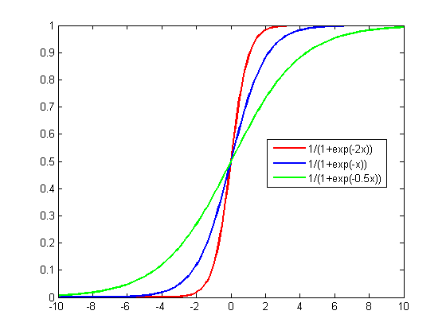

<style type="text/css">

body{ 

    font-size: 16px;
    line-height: 1.7em;
    <!-- text-align: justify; -->

}

blockquote {
    padding: 10px 20px;
    margin: 0 0 20px;
    font-size: 16px;
    border: solid 1px;
}

h1 { font-size: 32px; }

h2 { font-size: 24px; }

h3 { font-size: 20px; }

</style>

<br>

---

```{r setup, include=FALSE}
knitr::opts_chunk$set(echo = TRUE)

library(pacman)
p_load(tidyverse, stargazer, kableExtra, gridExtra, effects)

```

## Part 1: Simulate Data with Binary Outcomes  

```{r, echo = F}
# Support Same Sex Marriage (Yes=1) = Education + Age + Gender + Race

# -------Simulate IVs-------
set.seed(123)
# Years of education
eduy <- rpois(1000,12) 
#hist(eduy)
# Age
age <- rpois(1000,40) 
#hist(age)
# Gender dummy
female <- rbinom(1000, 1, 0.5)
#table(female)
# Race dummy
black <- rbinom(1000, 1, 0.3)
#table(black)

# -------Simulate DV-------
# log_odds is the log odds of supporting same-sex marriage
# Log odds is a LINEAR FUNCTION of IVs
log_odds = 0.8*eduy + (-0.2)*age + 0.8*female 

# Tranform log odds to probability using the logistic function
# which is the INVERSE FUNCTION of log odds
# p is the probability of supporting the same-sex marriage
p = exp(log_odds) / (1 + exp(log_odds))

# support is whether one supports same-sex marriage
# the value is generated according to one's probability p
set.seed(123)
support <- rbinom(1000, 1, p)

# Create dataframe
support_df <- tibble(
  support = support,
  eduy = eduy,
  age = age,
  female = female,
  black = black
)
```

---

### Part 1 Exercise  
  A logistic function or logistic curve is a common S-shaped curve (sigmoid curve) with equation
$$f(x)=\frac{L}{1+e^{-k(x-x_0)}},$$
  
  where:  
  
  $x_0$ is the $x$ value of the sigmoid's midpoint;  
  $L$ is the curve's maximum value;  
  $k$ is the logistic growth rate or steepness of the curve.  
  
  For example, the graph below plots logistic functions with $L = 1, x_0 = 0$ whereas $k = 2, 1, \text{and   } 0.5$.
  
<p align="center">
{width=50%}
</p>  
  
Question: Show that in a logistic regression model where

$$\log(\frac{p_i}{1-p_i}) = \beta_0 + \beta_1X_1 + \beta_2X_2 + ... + \beta_kX_k,$$

the probability $p_i$ can be expressed as a standard logistic sigmoid function of the linear combination of $X$ where $L=1, k=1, x_0 = 0$. That is, show that $p_i$ is a function of $z = \beta_0 + \beta_1X_1 + \beta_2X_2 + ... + \beta_kX_k$ where $p_i = f(z) = \frac{1}{1+e^{-z}}$.

*Hint:* The $\log$ in the above equation uses the natural log $\ln$, and recall that $e^{\ln x} = x$

**Answer:**

Let $$z = \beta_0 + \beta_1X_1 + \beta_2X_2 + ... + \beta_kX_k,$$  
Then we have:
  $$\log(\frac{p_i}{1-p_i}) = z$$
Take the natural exponent of both sides of the above equation:  
  $$e^{\log(\frac{p_i}{1-p_i}) } = e^z$$
Because $e^{\log x} = x$ (here $\log$ is $\ln$), we get:  
  $$\frac{p_i}{1-p_i} = e^z$$
  $$p_i = e^z (1-p_i)$$
  $$p_i = e^z-p_i\cdot e^z$$
  $$p_i + p_i\cdot e^z= e^z$$
  $$p_i (1 + e^z) = e^z$$
    $$p_i = \frac{e^z}{1 + e^z}$$
  $$p_i = \frac{1}{\frac{1}{e^z} + 1}$$
  $$p_i = \frac{1}{1 + e^{-z}}$$
  The above equation shows that $p_i$ is a standard logistic function of $z$, because when $L=1, k=1, x_0 = 0$, the logistic function $f(x)=\frac{L}{1+e^{-k(x-x_0)}}$ is:  
  
  $$f(x)=\frac{1}{1+e^{-x}}$$
  Therefore, $p_i$ is a function of $z = \beta_0 + \beta_1X_1 + \beta_2X_2 + ... + \beta_kX_k$ where $p_i = f(z) = \frac{1}{1+e^{-z}}$.  
  
  Note that the **standard logistic function** is sometimes referred to as the **inverse logit function** ($\text{logit}^{-1}$). The functional form of the **logit function** is just the log odds: $\log\frac{x}{1-x}$.  
  
  $$\frac{1}{1+e^{-x}} = \text{logit}^{-1}$$
  To say that $p_i$ is a standard logistic function of the linear combination of $X$ is equivalent as stating that $p_i$ is an inverse logit function of the linear combination of $X$.   
  
  $$p_i = \text{logit}^{-1}(\beta_0 + \beta_1X_1 + \beta_2X_2 + ... + \beta_kX_k)$$
  As we learn more about general linear model, you will know that logistic regression is a case of general linear model where the **link function** we use is the **inverse-logit function**.  

---

## Part 2: Linear Probability Model  


### Part 2 Exercise

Create two plots for this exercise and post your outputs on Slack.

1. Use the original dataset (`support_df`), plot a scatterplot with `eduy` on X and `support` on Y. Fitted an OLS line. For your `geom_point()` function, use `position = position_jitter(width = ..., height = ...)` to make the distribution of observations more discernible.

2. Plot a predicted effect of `eduy` on `support` according to `m4`. For the purpose of this exercise, use `seq(0, 25, 1)` to generate the number sequence for `eduy`.  

3. What are the *empirical* value ranges of X and Y, and what are the *modeling* value ranges of X and Y? 

```{r, echo=F}

m1 <- lm(support ~ eduy, support_df)
m2 <- lm(support ~ eduy + age, support_df)
m3 <- lm(support ~ eduy + age + female, support_df)
m4 <- lm(support ~ eduy + age + female + black, support_df)

```

```{r }


# 1. Scatterplot of original data
support_df %>%
  ggplot(aes(x = eduy, y = support)) +
  geom_point(shape = 1, position = position_jitter(width = 1, height = 0.03)) + 
  geom_smooth(method = "lm") + 
  labs(title = "Scatterplot of Support to Same-Sex Marriage by Education with Fitted OLS Line", 
       x = "Years of Education", 
       y = "Support to Same-Sex Marriage") +
  theme_bw() +
  theme(panel.grid.minor = element_blank())


# 2. Predicted Probability a/c to m4

# Create a dataframe with eduy vary
pred_dat <- tibble(
  eduy = seq(0, 25, 1), 
  age = mean(support_df$age),
  female = mean(support_df$female),
  black = mean(support_df$black)
)

# Generate Y_hat a/c to m4
yhat_lpm <- predict(m4, pred_dat, interval = "confidence", type = "response")

# Bind data
pred_lpm <- cbind(pred_dat, yhat_lpm)

# Plot
pred_lpm %>%
  ggplot(aes(x = eduy, y = fit)) +
  geom_point() +
  geom_line() +
  geom_ribbon(aes(ymin = lwr, ymax = upr), alpha = .3) +
  geom_hline(yintercept = 1, linetype = "dashed", color = "grey20") +
  geom_hline(yintercept = 0, linetype = "dashed", color = "grey20") +
  ylim(-0.5, 2) +
  annotate("rect", xmin = 3, xmax = 24, ymin = -0.5, ymax = 2,
        alpha = .1) +
  labs(title = "Predicted Probability of Support to Same-Sex Marriage by Education", 
       x = "Years of Education", 
       y = "Probability of Support", 
       subtitle = "Shaded area indicates empirical range of years of education in the sample") +
  theme_bw() +
  theme(panel.grid.minor = element_blank())
  


```
  
  3. The empirical range of $X$ is $[3, 24]$, Y is $Y \in (0, 1)$. The modeling range of $X$ is $(-\infty, \infty)$, and same for $Y$.

---

# Part 3: Logistic Regression  

### Part 3 Exercise

In a logistic regression model with two predictors:  
  
  $$\log(\frac{p_i}{1-p_i}) = \beta_0 + \beta_1X_1 + \beta_2X_2$$
Suppose the value of $X_2$ increases by one unit and we obtain the new probability $p_i'$, use $\beta_2$ to express the following: 

1. Additive difference in *log odds*:  

  $$\text{log odds}_i' - \text{log odds}_i =\log(\frac{p_i'}{1-p_i'}) - \log(\frac{p_i}{1-p_i}) = ?$$  

2. Multiplicative difference in *odds*, i.e. *odds ratio*:  

  $$\frac{\text{odds}_i'}{\text{odds}_i} = \frac{\frac{p_i'}{1-p_i'}}{\frac{p_i}{1-p_i}} = ?$$  
*Hint:* Recall that $a^n \cdot a^m = a^{n + m}, a^n \div a^m = a^{n - m}$
  
  
  **Answer:**

With one unit increase in $X_2$, we get: 

$$\log(\frac{p_i'}{1-p_i'}) = \beta_0 + \beta_1X_1 + \beta_2(X_2 + 1)$$

$$\log(\frac{p_i}{1-p_i}) = \beta_0 + \beta_1X_1 + \beta_2X_2 + \beta_2$$
$$\log(\frac{p_i'}{1-p_i'}) - \log(\frac{p_i}{1-p_i}) = \beta_0 + \beta_1X_1 + \beta_2X_2 + \beta_2 - (\beta_0 + \beta_1X_1 + \beta_2X_2) = \\ \beta_2$$
  Therefore, the additive difference in *log odds* is $\beta_2$.  
  
  
  
  Take the natural exponent on both sides of the above equation, since $a^{n - m} = a^n \div a^m$, we have: 

$$e^{\log(\frac{p_i'}{1-p_i'}) - \log(\frac{p_i}{1-p_i})} = e^{\beta_2}$$

$$e^{\log(\frac{p_i'}{1-p_i'})} \div e^{\log(\frac{p_i}{1-p_i})} = e^{\beta_2}$$

Since the $\log$ is natural log, and $e^{\log x} = x$, we have:

$$\frac{p_i'}{1-p_i'} \div \frac{p_i}{1-p_i} = e^{\beta_2}$$
Which is: 

$$\frac{\text{odds}_i'}{\text{odds}_i} = \frac{\frac{p_i'}{1-p_i'}}{\frac{p_i}{1-p_i}} = e^{\beta_2}.$$  
  

