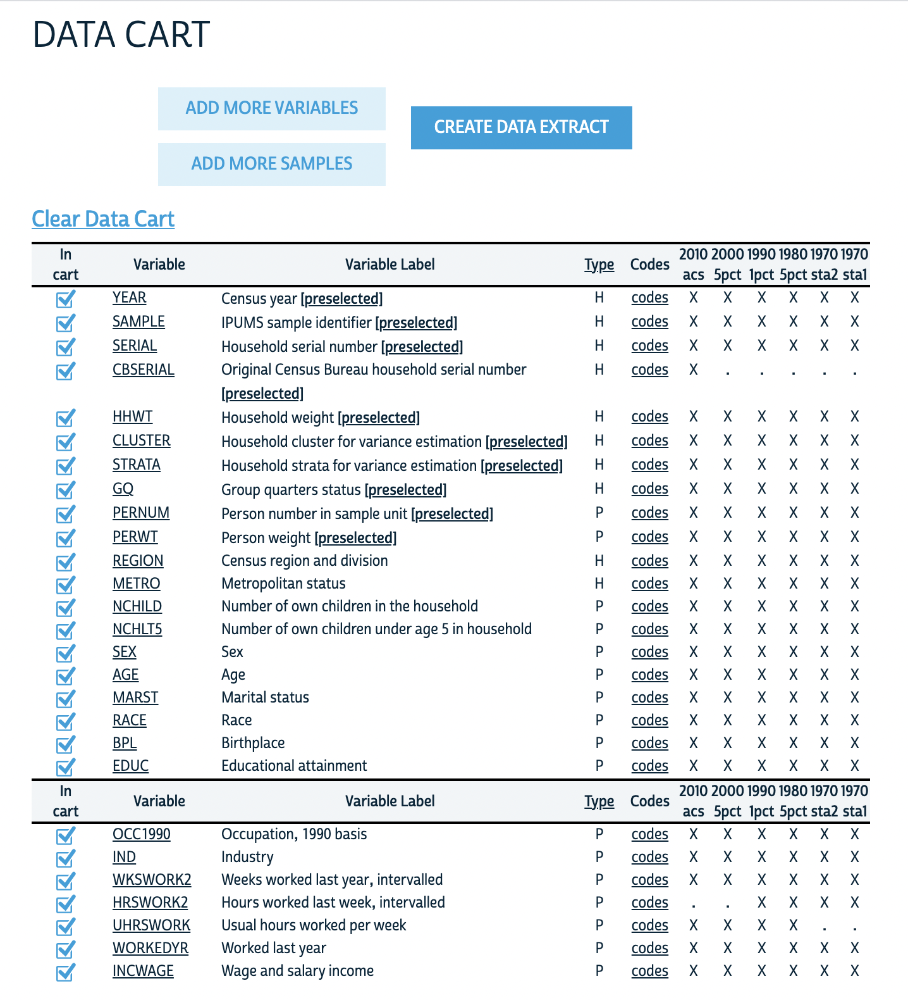

# Prerequisite

Load multiple packages to your environment using the following code:

```{r setup}
knitr::opts_chunk$set(echo = TRUE, results = "asis")
library(pacman)
p_load(tidyverse, foreign, corrplot, stargazer, coefplot, effects, kableExtra, scales)
```

# Part 1: The Replication Project 

#### 1. Read the paper closely and respond to the following questions:  
  (a) What are the authors’ research questions?
  
  **RQ: To what extent has the decrease in the racial pay gap over time been
  influenced by the different economic sources and trajectories of men and women?**
    
  (b) What is the gap in the literature that the authors aim to fill? How does their analysis advance the literature?

**The available literature on racial disparities in earnings largely only focuses on men, obscuring the interaction between race and gender and the complex patterns they produce. The authors are focused on addressing this gap through a longitudinal study of gender differences in racial earnings disparities from 1970 to 2010.They propose a new theoretical framework to establish reasonable expectations for wage disparities between different races/genders. Importantly, the authors try to create a framework that can account for decreases/change in the racial pay gap over time.**
    
  (c) What is the population that they are making inferences about? Be specific and make sure to identify the geographical region that they are focusing on, the time period, demographic characteristics, and so on.
  
**The population is all black and white workers (excluding Hispanic/other races) in the United States for every ten years from 1970 to 2010, ages 25 to 59.**
  
  (d) Do they have data on all individuals in the population? If they don’t, how do they solve this?
  
**No they do not have data on all individuals in the population. They have to use sample data collected by national surveys. Specifically they use a 5% census sample for 1980 and 2000, a 1% census sample for 1970 and 1990, and American Community Survey data for 2010.**
  
  (e) Did the authors collect the data themselves? If they did, describe their sampling procedure. If they didn’t, identify and describe the data source and discuss the sampling procedure that was used to collect this data. 

**No they did not. The authors used secondary data obtained through IPUMS.They use different sources to compile their data set: 1% and 5% random US census samples as well as data from the ACS.**
    
#### 2. As you read the text, make a list of all variables or characteristics of the population that the authors mention throughout the paper (e.g., gender, age, wages, occupation, ...). Submit a list with all the variables and characteristics that you have identified in the text.  

**
- gender (sex)  
- race  (excluding all but blacks and whites)
- age  (25-59)
- level of education  
- potential work experience and it squared (age - yrs of schooling -6)^6  
- weekly working hours  (and weekly working hours logged)  
- weekly wage (and weekly wage logged)  
- marital status  
- nativity status  
- number of children  
- presence of a child under 5 (=1)  
- sector, working in public service (=1)  
- region  
- metropolitan area (=1)  
- occupation (1990 codes)  
**

#### 3. Based on your answers to prior questions, select the samples and variables that you think you will need to replicate the paper in your IPUMS account. Submit a screenshot of the page where you can see the samples and variables that you have selected.

{width=60%}


# Part 2: Regression 

Import the dataset `sat_math.dta` to your R environment and examine the effect of IQ and other variables on SAT math score. *Hint:* use `read.dta()`
```{r}
# loading data into environment
sat_data <- read.dta("sat_math.dta") 
```

Variable Name|  Variable Detail
------------|----------------------------
 `sat_math`| SAT Math Score   
 `female`  | The Female Dummy (Male = 0) 
 `black/other`| Two Racial Dummies (White as the Reference Group) 
 `meduy`   | Mother’s Years of Schooling  
 `feduy`   | Father’s Years of Schooling  
 `hours`   | Average Weekly Study Hours   
 `IQ`      | IQ Score (0 to 100)          

#### 1. Report descriptive statistics:  

  (a) Create a table that reports descriptive statistics (you should at least report the means) of all the variables grouped by gender
  
```{r}
# Grouping data by gender (in this case, before recoding, grouping by female so male=0 and female=1) and producing descriptive statistics
sat_data %>% group_by(female) %>% summarise(mean_satmath = mean(sat_math), mean_meduy = mean(meduy), mean_feduy = mean(feduy), mean_hours = mean(hours), mean_IQ = mean(IQ))

```
  
  (b) Create a correlation matrix and display it
  
```{r}
## Set use = "complete.obs" to ignore observations with NAs
M <- cor(sat_data, use = "complete.obs")

# Save the matrix to a dataframe, then use `corrplot` to visualize 
corrplot(M,
         method = "shade",
         cl.lim = c(-1,1),
         is.corr = F,
         type = "lower",
         title = "  
         Correlation Matrix",
         addCoef.col = "black",
         diag = F,
         tl.col = "black",
         )
```

#### 2. Create scatter plots:  
  - Besides the key dependent variable (DV) `sat_math`, choose one numeric independent variable (IV) that seems to have a meaningful relation to the DV based on the correlation matrix you created, and then create the following plots:
  (a) A scatter plot of the DV and IV  
  (b) A scatter plot of the DV and IV with a fitted linear regression line  
  (c) A scatter plot of the DV and IV, and each observation is color coded by gender  
  (d) On top of plot (c), fit a linear regression line for each gender group, the lines should also be color coded  
  
```{r part2-2}
#   (a) A scatter plot of the DV and IV, IQ   
sat_data %>%
  ggplot(aes(x = IQ, y = sat_math)) +
  geom_point(shape = 1, alpha = 0.7) +
  labs(title = "Relationship Between IQ and SAT Math Score",
       x = "IQ",
       y = "SAT Math Score")

#  (b) A scatter plot of the DV and IV with a fitted linear regression line  
sat_data %>%
  ggplot(aes(x = IQ, y = sat_math)) +
  geom_point(shape = 1, alpha = 0.7) +
  geom_smooth(method = "lm", se = F) +
  labs(title = "Relationship Between IQ and SAT Math Score",
       x = "IQ",
       y = "SAT Math Score")

# (c) A scatter plot of the DV and IV, and each observation is color coded by gender       
# Create new variable 'gender'
sat_data <- sat_data %>%
  mutate(gender = ifelse(female == 1, "female", "male"))

sat_data %>% as_tibble() %>% ggplot(aes(x = IQ, y = sat_math, color = gender)) +
  geom_point(shape = 1) +
  labs(title = "Relationship Between IQ and SAT Math Score",
       x = "IQ",
       y = "SAT Math Score",
       subtitle = "Grouped by gender")

# (d) On top of plot (c), fit a linear regression line for each gender group, the lines should also be color coded
sat_data %>% as_tibble() %>%
  ggplot(aes(x = IQ, y = sat_math, color = gender)) +
  geom_point(shape = 1) +
  geom_smooth(method = "lm", se = F) +
  labs(title = "Relationship Between IQ and SAT Math Score",
       x = "IQ",
       y = "SAT Math Score",
       subtitle = "Grouped by gender")
```

  
#### 3. Additional exploratory data analysis:  
  (a) What are your preliminary findings/reflections on the data based on the descriptive statistics, the correlation matrix, and the scatter plots?

**Based on the descriptive statistics, we know that all together students spend an average of 39 hours studying per week and that males and females spend roughly the same amount of time studying each week. On average females score 47 points higher than males.In terms of IQ, males on average scored 2 points higher. We also know the data is somewhat skewed to the right (median < mean), which means that less people are making higher SAT math scores than if the data were normally distributed. Based on the correlation plot, IQ has the strongest positive correlation with SAT math scores (0.65). Parents' years of schooling is also strongly correlated with higher SAT math scores, more so than with the other explanatory variables. For number of hours studied per week, there is a very minor negative relationship between average hours studied per week and SAT math scores (-0.03). This weak relationship is confirmed through the scatterplots, especially those with regression lines which show that while females tend to score higher, average weekly hours studied is not strongly correlated with SAT math** 
    
  (b) What other exploratory data analysis will be useful for you to better understand the data before modeling? Please implement some additional exploratory data analysis and discuss your preliminary findings
  
**First we can create histograms of each variable to understand their distributions. Other exploratory data analyses before modeling include plotting the relationship between SAT math scores and our other predictor variables to visually understand their relationships.The data can also be grouped by race in order to look at racial differences in SAT math scores at different levels of predictors.**

```{r}
# Creating histograms of variables

# Plotting dependent variable
sat_data %>% as_tibble() %>%
  ggplot(aes(x = sat_data$sat_math)) +
  geom_histogram(binwidth = 50, fill = "grey", color = "black")

# Plotting independent variables
sat_data %>% as_tibble() %>%
  ggplot(aes(x = sat_data$IQ)) +
  geom_histogram(binwidth = 10, fill = "grey", color = "black")

sat_data %>% as_tibble() %>%
  ggplot(aes(x = sat_data$feduy)) +
  geom_histogram(binwidth = 1, fill = "grey", color = "black")

sat_data %>% as_tibble() %>%
  ggplot(aes(x = sat_data$meduy)) +
  geom_histogram(binwidth = 1, fill = "grey", color = "black")

sat_data %>% as_tibble() %>%
  ggplot(aes(x = sat_data$hours)) +
  geom_histogram(binwidth = 1, fill = "grey", color = "black")
```

```{r part2-3}
# Creating scatterplots with other predictors 

# Looking at hours, still grouped by gender
sat_data %>% as_tibble() %>%
  ggplot(aes(x = hours, y = sat_math, color = gender)) +
  geom_point(shape = 1) +
  geom_smooth(method = "lm", se = F) +
  labs(title = "Relationship Between Average Weekly Study Hours and SAT Math Score",
       x = "Average Weekly Study Hours",
       y = "SAT Math Score",
       subtitle = "Grouped by gender")

# Looking at father's years of education, still grouped by gender
sat_data %>% as_tibble() %>%
  ggplot(aes(x = feduy, y = sat_math, color = gender)) +
  geom_point(shape = 1) +
  geom_smooth(method = "lm", se = F) +
  labs(title = "Relationship Between Father's Years of Education and SAT Math Score",
       x = "Father's Years of Education",
       y = "SAT Math Score",
       subtitle = "Grouped by gender")

# Looking at mother's years of education, still grouped by gender
sat_data %>% as_tibble() %>%
  ggplot(aes(x = meduy, y = sat_math, color = gender)) +
  geom_point(shape = 1) +
  geom_smooth(method = "lm", se = F) +
  labs(title = "Relationship Between Mother's Years of Education and SAT Math Score",
       x = "Mother's Years of Education",
       y = "SAT Math Score",
       subtitle = "Grouped by gender")
```

```{r}
# Grouping data by race and running similar analyses (descriptive stats, scatterplots)
sat_data %>% group_by(black, other) %>% summarise(mean_satmath = mean(sat_math), mean_meduy = mean(meduy), mean_feduy = mean(feduy), mean_hours = mean(hours), mean_IQ = mean(IQ))
```

```{r}
# Running similar comparisons grouped non-white vs white
sat_data <- sat_data %>% mutate(race = ifelse(black | other > 0, "non-white", "white"))

# Creating more plots comparing non-whites vs. whites

# Looking at hours studied, grouped by race 
sat_data %>% as_tibble() %>%
  ggplot(aes(x = hours, y = sat_math, color = race)) +
  geom_point(shape = 1) +
  geom_smooth(method = "lm", se = F) +
  labs(title = "Relationship Between Average Weekly Study Hours and SAT Math Score",
       x = "Average Weekly Study Hours",
       y = "SAT Math Score",
       subtitle = "Grouped by race")

# Looking at IQ, still grouped by race
sat_data %>% as_tibble() %>%
  ggplot(aes(x = IQ, y = sat_math, color = race)) +
  geom_point(shape = 1) +
  geom_smooth(method = "lm", se = F) +
  labs(title = "Relationship Between IQ and SAT Math Score",
       x = "IQ",
       y = "SAT Math Score",
       subtitle = "Grouped by race")

# Looking at father's years of education, still grouped by race
sat_data %>% as_tibble() %>%
  ggplot(aes(x = feduy, y = sat_math, color = race)) +
  geom_point(shape = 1) +
  geom_smooth(method = "lm", se = F) +
  labs(title = "Relationship Between Father's Years of Education and SAT Math Score",
       x = "Father's Years of Education",
       y = "SAT Math Score",
       subtitle = "Grouped by race")

# Looking at mother's years of education, still grouped by race
sat_data %>% as_tibble() %>%
  ggplot(aes(x = meduy, y = sat_math, color = race)) +
  geom_point(shape = 1) +
  geom_smooth(method = "lm", se = F) +
  labs(title = "Relationship Between Mother's Years of Education and SAT Math Score",
       x = "Mother's Years of Education",
       y = "SAT Math Score",
       subtitle = "Grouped by race")
```

#### 4. Nested models:  
  - Build five nested models that use `sat_math` as the DV and report regression results in a table using `stargazer()` from the `stargazer` package. 
  (a) Model 1: Baseline (only add "IQ" as the independent variable)  
  (b) Model 2: Model 1 + Demographic Characteristics  
  (c) Model 3: Model 2 + Parental Education  
  (d) Model 4: Model 3 + Weekly Study Hours  
  (e) Model 5: Model 4 + An Interaction Between IQ and the Female Dummy
  
```{r part2-4}
# Creating the five models
m1 <- lm(sat_math ~ IQ, data = sat_data)
m2 <- lm(sat_math ~IQ + female + black + other, data = sat_data)
m3 <- lm(sat_math ~IQ + female + black + other + feduy + meduy, data = sat_data)
m4 <- lm(sat_math ~IQ + female + black + other + feduy + meduy + hours, data = sat_data)
m5 <- lm(sat_math ~IQ + female + black + other + feduy + meduy + hours + IQ*female, data = sat_data)

stargazer(m1, m2, m3, m4, m5, type = "latex", omit.stat=c("f", "ser"))
```
  
#### 5. For the result of Model 1:  
  (a) What are the hypotheses that you are testing in this model with your t-values in the `(Intercept)` and `IQ` row of the modeling results?  
  
  **Our null hypothesis is, holding all other variables constant, $\beta_{\text{IQ}}$ = 0. Our alternative hypothesis is $\beta_{\text{IQ}}$ != 0. Our prediction equation is Y&#770 = 4.211X + 315.605.**
  
  (b) Create a 95% confidence interval for the parameter $\beta_{\text{IQ}}$ based on Model 1 result.

```{r part2-5}
# starting with mean squared error
sat_data <- sat_data %>%
  mutate(IQmean <- mean(sat_data$IQ),
sat_math_mean <- mean(sat_data$sat_math),
y_fitted = 315.605 + 4.211*IQ)

SSE <- (sat_data$sat_math - sat_data$y_fitted)^2 %>% sum()
MSE <- SSE/(nrow(sat_data)-2)
denomi <- (sat_data$IQ - sat_data$IQmean)^2 %>% sum() 

# calculating standard error 
se <- sqrt(MSE/denomi)

#Creating confidence interval
upperbound <- 4.211 + (1.96*se)
lowerbound <- 4.211 - (1.96*se)
CI <- c(lowerbound,upperbound) %>% print()
```

#### 6. Interpret regression coefficients:  
  (a) How does the coefficient of "IQ" change across models? What could be the possible reason(s) for such changes?  
  
  **The coefficient of IQ changes from 4.211, to 4.356, to 3.487, to 3.484, and finally to 2.893. The increase from m1 to m2 suggests that adding these minority demographic predictors (female/black/other) increases the partial effects of IQ by itself on SAT math score.The decreases of the coefficient from m2 to m5 suggests the partial effects of the IQ by itself on SAT math scores lessens in intensity when other significant predictors are added to the model, such as parent's years of education, hour spent studying, and interaction between gender and IQ.**
  
  (b) Interpret the coefficient of "black" in Model 4.
  
  **The coefficient of -14.519 for "black" in model 4 means that black people (the comprarison group) on average score 14.519 points lower than white peoplev (the comparison group), holding all else constant.**
  
  (c) Interpret the coefficient of "meduy" in Model 4.  
  
  **The coeffiecent of 6.434. for "meduy" in model 4 means that for each additional year of a person's mother's education, their SAT math score increases 6.434, holding all else constant.**
  
  (d) Interpret the coefficient of the interaction effect between IQ and the Female Dummy in Model 5.
  
  **The coefficient of 1.232 for the interaction term in model 5 means that the effect of IQ on SAT math scores is greater for females, with a 1.232 point difference.** 
  
#### 7. Create a coefficient plot for Model 5 with appropriate title and labels.

```{r, fig.align='left'}
coefplot(m5, 
         innerCI = 1.96,
         outerCI = 1.96,
         intercept = F)
```

#### 8. On the basis of Model 5, by holding other variables at their means, create a figure demonstrating the predicted SAT math score by gender and IQ levels (with confidence interval)

```{r}
pred_IV <- tibble(IQ = rep(14:89, 2)) %>%         #create df with key IV
  mutate(female = c(rep(0, 76), rep(1, 76)),   # fix other variables at mean
         hours = mean(sat_data$hours, na.rm = T),
         meduy = mean(sat_data$meduy, na.rm = T),
         feduy = mean(sat_data$feduy, na.rm = T),
         black = mean(sat_data$black, na.rm = T),
         other = mean(sat_data$other, na.rm = T))
```

```{r}
# use `predict` to predict the Y
predicted_math <- predict(m5,    # the model you are using
                             pred_IV,  # the df you use for predicting
                             interval = "confidence", # set CI
                             level = 0.95)

# bind the columns
pred_result <- cbind(pred_IV, predicted_math)
```

```{r}
# Plot
pred_result %>% 
  mutate(gender = ifelse(female == 0, "Male", "Female")) %>%       # Covert dummy to character variable
  ggplot(aes(x = IQ, y = fit)) +
  geom_line(aes(linetype = gender)) +                              # group linetype by gender
  geom_ribbon(aes(ymin = lwr, ymax = upr, fill = gender), alpha = 0.3) +   # add 95% CI
  theme_classic() +
  labs(x = "IQ",
       y = "Predicted SAT Math Score") +
  ggtitle("Predicted SAT Math Score by IQ and Gender",
          subtitle = "(Modeled with interaction between IQ and gender)")
```
  
# Part 3 (Bonus) Data Simulation 

Simulation is a fun and effective way to learn about statistical inference. You will get a better understanding of how each population parameter affects the shape of the distribution.  
  
  Now that we have learned about how to identify interactions from a given sample, you can try simulate a data whose true data generating process involves interaction between two variables. For example, you can try to reproduce a similar scatter plot we saw in class (the right panel) by simulating a data whose variables have such associations:

{width=60%}
  
  Or, you can try to reproduce a scatter plot that demonstrates the Simpson's Paradox:
  
{width=40%}

*Note:* Your output does not need to replicate the exact layout of the example graphs. You will get extra credit as long as you generate a similar graph that illustrates the relationship (either a positive or negative interaction, or the Simpson's Paradox) clearly. Remember to use `set.seed()` for any random process.

```{r}
# This simulation shows the effects of education level and "self control" (measured from 0-5) on GRE scores (130-340). The simulation shows that, for people with more education, the effects of self control are more significant for their GRE scores. 

n <- 1000

# Simulating IV variables, education and self control, and DV variable GRE Score
set.seed(1234)
education <- rbinom(n, 2, 0.5)
self_control <- rnorm(n)
GRE <- 30 + 2*education + 6*self_control + (2*education)*(6*self_control) + rnorm(n, 0, 10)

# labeling three different edu values
education = factor(education, labels = c("Low", "Medium", "High"))

# rescaling variables
GRE = rescale(GRE, to = c(130, 340))
self_control = rescale(self_control, to = c(0, 5))

# creating data frame with variables
data <- data.frame(
  education,
  GRE,
  self_control
)

# Creating the scatterplot
data %>% ggplot(aes(self_control, GRE)) +
  geom_point(aes(col = education), alpha = 0.7) +
  geom_smooth(aes(col = education), method = 'lm') +
  labs(title = "Simulation of Interaction between  
       Education and Self Control on GRE Score", x = "Self Control", y = "GRE Score") +
  theme(legend.background = element_rect(fill = "transparent"),
        legend.justification = c(0, 1),
        legend.position = c(0, 1))
```