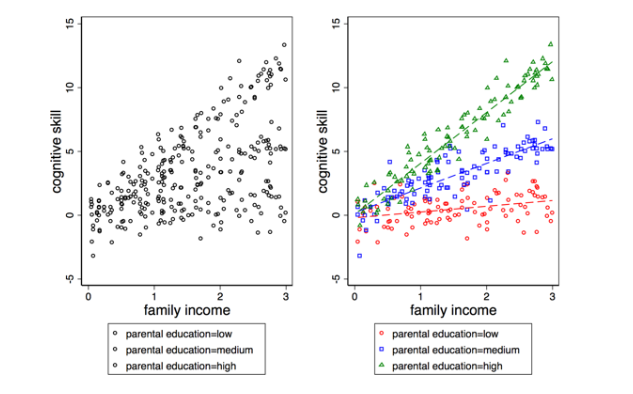
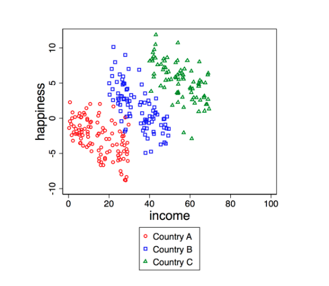

# Prerequisite

Load multiple packages to your environment using the following code (you can add more packages to the current list as per your need):

```{r setup}
knitr::opts_chunk$set(echo = TRUE)

library(pacman)
p_load(tidyverse, foreign, corrplot, stargazer, coefplot, effects, psych, ggcorrplot)

```

# Part 1: The Replication Project 

#### 1. Read the paper closely and respond to the following questions:  
  (a) What are the authors’ research questions?  
  
    - RQ: To what extent has the decrease in the racial pay gap over time been
    influenced by the different economic sources and trajectories of men and women?
    
  (b) What is the gap in the literature that the authors aim to fill? How does their analysis advance the literature?
  
    - The authors are focused on the intersection of race and gender in producing
    wage gaps, and their proposal of a new theoretical framework aims to establish
    reasonable expectations for wage disparities between different races/genders.
    Importantly, the authors try to create a framework that can account for
    changes in the racial pay gap over time. 
    
  (c) What is the population that they are making inferences about? Be specific and make sure to identify the geographical region that they are focusing on, the time period, demographic characteristics, and so on.  
  
  - The population is all black and white workers in the United States for every
  ten years from 1970 to 2010, ages 25 to 59.
  
  (d) Do they have data on all individuals in the population? If they don’t, how do they solve this?
  
  - No they do not have data on all individuals in the population. They have to use sample data collected by surveys. Specifically they use a 5% census sample for 1980 and 2000, a 1% census sample for 1970 and 1990, and American Commnunity Survey data for 2010. 
  
  (e) Did the authors collect the data themselves? If they did, describe their sampling procedure. If they didn’t, identify and describe the data source and discuss the sampling procedure that was used to collect this data. 
  - The authors used secondary data obtained from IPUMS.They use different sources to compile their data set: 1% and 5% US census samples as well as data from the ACS. 
    
#### 2. As you read the text, make a list of all variables or characteristics of the population that the authors mention throughout the paper (e.g., gender, age, wages, occupation, ...). Submit a list with all the variables and characteristics that you have identified in the text.  
*Note:* Make sure to read footnotes and table notes; they contain important information to understand who is in the sample. 

- gender
- race 
- earnings
- level of education
- potential work experience and it squared (age - yrs of schooling -6)^6
- weekly working hours
- weekly working hours logged
- weekly wage
- wekly wage logged
- marital status
- nativity status
- number of children
- presemce of a child under 5 (=1)
- sector, working in public service (=1)
- region
- metropolitan area (=1)
- Occupation

#### 3. Based on your answers to prior questions, select the samples and variables that you think you will need to replicate the paper in your IPUMS account. Submit a screenshot of the page where you can see the samples and variables that you have selected.
*Note:* you can obtain this from your "Data Cart”.  
  
    
  


# Part 2: Regression 

Import the dataset `sat_math.dta` to your R environment and examine the effect of IQ and other variables on SAT math score. *Hint:* use `read.dta()`
```{r}
# loading data into environment
sat_data <- read.dta("sat_math.dta") 
```

Variable Name|  Variable Detail
------------|----------------------------
 `sat_math`| SAT Math Score   
 `female`  | The Female Dummy (Male = 0) 
 `black/other`| Two Racial Dummies (White as the Reference Group) 
 `meduy`   | Mother’s Years of Schooling  
 `feduy`   | Father’s Years of Schooling  
 `hours`   | Average Weekly Study Hours   
 `IQ`      | IQ Score (0 to 100)          

#### 1. Report descriptive statistics:  
  (a) Create a table that reports descriptive statistics (you should at least report the means) of all the variables grouped by gender
```{r}
# Grouping data by gender and producing descriptive statistics
sat_data <- sat_data %>% group_by(female)

describe(sat_data)
```
  
  (b) Create a correlation matrix and display it.
```{r}

## Set use = "complete.obs" to ignore observations with NAs
M <- cor(sat_data, use = "complete.obs")

# Save the matrix to a dataframe, then use `ggcorrplot` to visualize 

ggcorrplot(as.data.frame(M), 
           hc.order = TRUE, 
           type = "lower", 
           lab = TRUE)
```

#### 2. Create scatter plots:  
  - Besides the key dependent variable (DV) `sat_math`, choose one numeric independent variable (IV) that seems to have a meaningful relation to the DV based on the correlation matrix you created, and then create the following plots:
  (a) A scatter plot of the DV and IV  
  (b) A scatter plot of the DV and IV with a fitted linear regression line  
  (c) A scatter plot of the DV and IV, and each observation is color coded by gender  
  (d) On top of plot (c), fit a linear regression line for each gender group, the lines should also be color coded  
  
```{r part2-2}
#   (a) A scatter plot of the DV and IV  
sat_data %>%
  ggplot(aes(x = feduy, y = sat_math)) +
  geom_point(shape = 1, alpha = 0.7) +
  labs(title = "Relationship Between Father's
       Years of Education and SAT Math Score",
       x = "Father's Years of Edu",
       y = "SAT Math Score")

#  (b) A scatter plot of the DV and IV with a fitted linear regression line  
sat_data %>%
  ggplot(aes(x = feduy, y = sat_math)) +
  geom_point(shape = 1, alpha = 0.7) +
  geom_smooth(method = "lm", se = F) +
  labs(title = "Relationship Between Father's 
       Years of Education and SAT Math Score",
       x = "Father's Years of Edu",
       y = "SAT Math Score")

# (c) A scatter plot of the DV and IV, and each observation is color coded by gender       
# Create new variable 'gender'
sat_data <- sat_data %>%
  mutate(gender = ifelse(female == 1, "female", "male"))

sat_data %>% as_tibble() %>% ggplot(aes(x = feduy, y = sat_math, color = gender)) +
  geom_point(shape = 1) +
  labs(title = "Relationship Between Father's 
       Years of Education and SAT Math Score",
       x = "Father's Years of Edu",
       y = "SAT Math Score")

# (d) On top of plot (c), fit a linear regression line for each gender group, the lines should also be color coded
sat_data %>% as_tibble() %>%
  ggplot(aes(x = feduy, y = sat_math, color = gender)) +
  geom_point(shape = 1) +
  geom_smooth(method = "lm", se = F) +
  labs(title = "Relationship Between Father's 
       Years of Education and SAT Math Score",
       x = "Father's Years of Edu",
       y = "SAT Math Score")
```

  
#### 3. Additional exploratory data analysis:  
  (a) What are your preliminary findings/reflections on the data based on the descriptive statistics, the correlation matrix, and the scatter plots?  
  (b) What other exploratory data analysis will be useful for you to better understand the data before modeling? Please implement some additional exploratory data analysis and discuss your preliminary findings.

```{r part2-3}


```

#### 4. Nested models:  
  - Build five nested models that use `sat_math` as the DV and report regression results in a table using `stargazer()` from the `stargazer` package.*Note:* You can set `type = "text"` in `stargazer()` when viewing the table in R, but before knitting to PDF you should set `type = "latex"`  
  (a) Model 1: Baseline (only add "IQ" as the independent variable)  
  (b) Model 2: Model 1 + Demographic Characteristics  
  (c) Model 3: Model 2 + Parental Education  
  (d) Model 4: Model 3 + Weekly Study Hours  
  (e) Model 5: Model 4 + An Interaction Between IQ and the Female Dummy
```{r part2-4}
# Creating the five models

m1 <- lm(sat_math ~ IQ, data = sat_data)
m2 <- lm(sat_math ~IQ + female + black + other, data = sat_data)
m3 <- lm(sat_math ~IQ + female + black + other + feduy + meduy, data = sat_data)
m4 <- lm(sat_math ~IQ + female + black + other + feduy + meduy + hours, data = sat_data)
m5 <- lm(sat_math ~IQ + female + black + other + feduy + meduy + hours + IQ*female, data = sat_data)

stargazer(m1, m2, m3, m4, m5, type = "text")

```
  
  
#### 5. For the result of Model 1:  
  (a) What are the hypotheses that you are testing in this model with your t-values in the `(Intercept)` and `IQ` row of the modeling results?  
  (b) Create a 95% confidence interval for the parameter $\beta_{\text{IQ}}$ based on Model 1 result.

```{r part2-5}


```

#### 6. Interpret regression coefficients:  
  (a) How does the coefficient of "IQ" change across models? What could be the possible reason(s) for such changes?  
  (b) Interpret the coefficient of "black" in Model 4.  
  (c) Interpret the coefficient of "meduy" in Model 4.  
  (d) Interpret the coefficient of the interaction effect between IQ and the Female Dummy in Model 5.  
  
#### 7. Create a coefficient plot for Model 5 with appropriate title and labels.  
```{r part2-7}


```

#### 8. On the basis of Model 5, by holding other variables at their means, create a figure demonstrating the predicted SAT math score by gender and IQ levels (with confidence interval).  
```{r part2-8}


```
  
  
  
# Part 3 (Bonus) Data Simulation 

Simulation is a fun and effective way to learn about statistical inference. You will get a better understanding of how each population parameter affects the shape of the distribution.  
  
  Now that we have learned about how to identify interactions from a given sample, you can try simulate a data whose true data generating process involves interaction between two variables. For example, you can try to reproduce a similar scatter plot we saw in class (the right panel) by simulating a data whose variables have such associations:

{width=60%}
  
  Or, you can try to reproduce a scatter plot that demonstrates the Simpson's Paradox:
  
{width=40%}


*Note:* Your output does not need to replicate the exact layout of the example graphs. You will get extra credit as long as you generate a similar graph that illustrates the relationship (either a positive or negative interaction, or the Simpson's Paradox) clearly. Remember to use `set.seed()` for any random process.

```{r part3}


```
