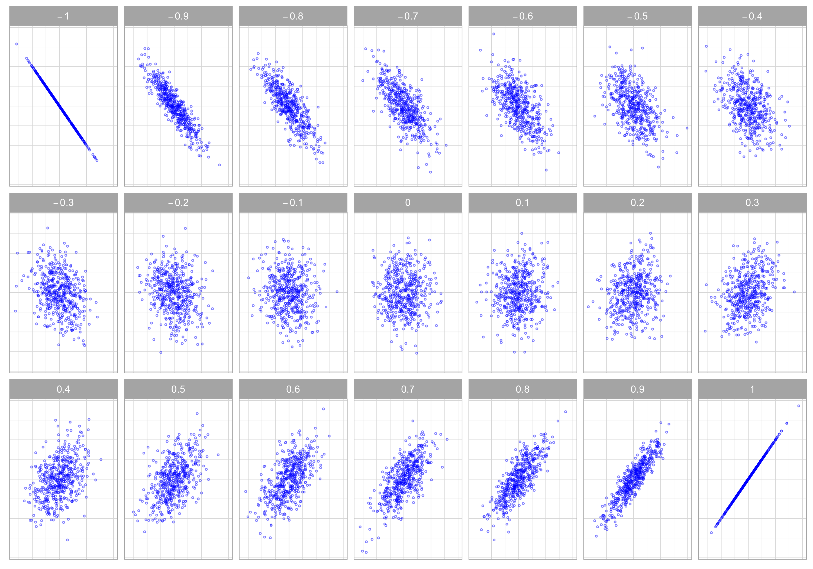

```{r setup, include=FALSE, results = "asis"}
knitr::opts_chunk$set(echo = TRUE)
library(pacman)
p_load(kableExtra, tidyverse, stargazer, plm, MASS, foreign, tibble, car)
```

# Part 1 Forensic Statistics and the Chi-Square Test  

Human beings are very bad at making up numbers. If you are told to come up with a sequence of random numbers, you will likely end up following some sort of pattern that is far from being random. For example, to pretend that your are selecting numbers at random, you will tend to pick "random-looking" numbers like 48 more often than "nonrandom-looking" numbers like 100. Picking "random-looking" numbers more often than "nonrandom-looking" ones is something that shouldn't occur randomly. The Chi-Square test provides us with a useful framework to formally detect this. One of its many applications is the detection of election fraud.  
  
  Imagine that you are part of a team of international observers that has been called to assess whether there is evidence of fraud in a general election that took place in a foreign country. Two candidates were on the ballot: Candidate A (the incumbent) and Candidate B. Candidate A won the election with 62% of the votes. One week after the election, some raised concerns about the validity of this result and suggested the possibility that election fraud could have occurred.^[These are real data from the Iranian election that was held on June 12, 2009. This exercise has been inspired by one example used by Dan Levy in his "Advanced Quantitative Methods" course at the Harvard Kennedy School.]  
  
  The setting is the following. There were 116 voting stations across the country. Each voting station has sent you the count of votes that went to Candidate A. To assess election fraud, you will be evaluating the frequency with which the final digit in each of these counts appears in the data. The table below shows precisely this. The first column list all values that the last digit in a vote count can take on (0 to 9). For example, if the number of votes that went to Candidate A in voting station #24 was 659, the final digit of this vote count would be 9. The second column tells you the frequency with which each final digit appeared across all voting stations. Among the 116 voting stations, 11 reported a number of votes for Candidate A that ended in 1, 8 reported a number of votes for Candidate A that ended in 2, and so on.
  

```{r , echo=FALSE}

tbl <- tibble(`Final Digit` = c(seq(1, 9, 1), 0, "Total"),
              `Observed Count` = c(11, 8, 9, 10, 5, 14, 20, 17, 13, 9, 116))
              
tbl %>% kbl(booktabs = T, align = "c") %>% kable_styling(full_width = F)
```
  
  Answers the questions below:  
  
  1. If the election results had not been manipulated (i.e., fraud did not occur), what would be your best guess for the number of voting stations that reported a vote count for Candidate A ending in 1? And in 6? And in 9?

Ending in 1: $f^e$ = (116/10) = 11.6
Ending in 6: $f^e$ = (116/10) = 11.6
Ending in 9: $f^e$ = (116/10) = 11.6
  
  
  2. If the election results had not been manipulated, what is the probability that a vote count for Candidate A ended in1? And in 6? And in 9?  
  
Ending in 1: 11.6 out of 116 or = 0.1
Ending in 6: 11.6 out of 116 or = 0.1
Ending in 9: 11.6 out of 116 or = 0.1
  
  3. Following the logic from questions 1 and 2, complete columns 3 to 5 in the table below.
  
```{r , echo = F}

tbl2 <- tibble(`Final Digit` = c(seq(1, 9, 1), 0, "Total"),
              `Observed Count` = c(11, 8, 9, 10, 5, 14, 20, 17, 13, 9, 116),
              `Observed Share` = c(11/116, 8/116, 9/116, 10/116, 5/116, 14/116, 20/116, 17/116, 13/116, 9/116, 116/116) %>% round(digits =2),
              `Expected Count` = c(11.6, 11.6, 11.6, 11.6, 11.6, 11.6, 11.6, 11.6, 11.6, 11.6, 116),
              `Expected Share` = c(rep(11.6/116, 10), 1.00),
              `Chi-Square Stat` = c(0.03, 1.12, 0.58, 0.22, 3.76, 0.50, 6.08, 2.51, 0.17, 0.58, sum(0.03, 1.12, 0.58, 0.22, 3.76, 0.50, 6.08, 2.51, 0.17, 0.58) )
              )
              
tbl2 %>% 
  kbl(booktabs = T, align = "c") %>% 
  kable_styling(latex_options = "striped", full_width = F)
```

  4. Do the expected counts and shares match the observed ones? Just by looking at these discrepancies, are you able to determine whether fraud occurred? 
  
**Our observed counts do no match our expected counts. However, we are not able to determine whether fraud occurred from just looking at raw count distributions. Chi-Square test is needed to determine statistical independence or dependence.** 
  
  5. Formally define the null and alternative hypotheses for the test of "no fraud" in that election.
  
**$H_0$ = The final digit of the vote count across voting stations and the observed count are statistically independent.**

**$H_a$ = The final digit of the vote count across voting stations and the observed count are statistically dependent.**
  
  6. Calculate the $\chi^2$ statistics for each row in the table (Column 6). Keep in mind that the $\chi^2$ statistic is computed form counts, not from proportions. 
  
```{r}
#calculating chi-squared for each row
# create data frame 
df <- tibble(final_digit = c(seq(1, 9, 1), 0),
              observed_count = c(11, 8, 9, 10, 5, 14, 20, 17, 13, 9),
             expected_count = c(rep(11.6, 10)))

# create  variable for chi-squared, rounded to 2 decimal places
df <- df %>%
  rowwise() %>% 
  mutate(
    chi_squared = ((observed_count - expected_count)^2)/expected_count
    ) %>%
  round(digits = 2)

df$chi_squared #chi-squared by row
```
  

  7. Calculate the $\chi^2$ statistic for the entire distribution of outcomes and calculate the p-value.
```{r}
total_chi_sq <- sum(df$chi_squared) #adding all rows together
total_chi_sq
p_value <- pchisq(total_chi_sq, df=9, lower.tail=F) 
# calculating p-value with pchisq function, 9 degrees of freedom 
p_value
```
  

  8. Do you reject or fail to reject the null hypothesis of no fraud (use significance level $\alpha$ = .05).
  
**Because the p-value(.077) > .05, we fail to reject the null hypothesis of no fraud. **

  9. Write 3 paragraphs reporting your findings and explaining the logic that you followed to detect fraud in this election. You are writing this to someone who understands the concepts of sampling and ran- domness, but does not know what a Chi-Square test is. Imagine that this analysis is part of an academic article, and you have been invited to write a non-technical summary of your findings for the Upshot or Wonkblog.


**In order to determine if election fraud happened, we can determine if the last digit of each count is really randomly distributed across voting stations. We would expect that this last digit has nothing to do with the number of votes at each station, if there was no fraud. Even if the numbers might look off at first glance - meaning non-random - this might not hold true after statistical tests. If there was no election fraud, then we can expect that the last digit of the vote count for Candidate A across all voting stations is statistically independent from the count we actually observe.** 

**Chi-Square test can help us determine statistical independence. It quantifies the difference between what we would expect the vote count to be with no fraud and what the vote count we actually observe is at each voting station. If the chi-squared test tell us that the last digit and the vote count are dependent, then we have evidence of election fraud.**

**First, we need to set a cutoff point so we know what is a statistically significant result. We set it at .05, which means that we give ourselves a small, 5% risk of concluding there is statistical dependence when there actually isn't. After doing a chi-squared test for each voting station and adding the numbers together, we also get a corresponding "p-value" which we compare against the significance level we set earlier. The p-value we calculate is 0.077, which is greater than the .05 significance level. Since this p-value is greater, our chi-square test of independence tells us that we don't have sufficient evidence to conclude that the last digit and the observed vote count are dependent on each other. Thus, we cannot conclude that election fraud took place.**  


# Part 2: Fixed-Effects Model

In this exercise, we use the dataset `sibling_data.dta` to study the effect of mother experiencing stress in pregnancy on child’s birth weight. All variables are described in the table below.
  
Variable Name|  Variable Detail
------------|----------------------------
 *Group Variable* | 
 `householdid` | Unique household id; Siblings from the same household share the same household id
               |
 *Dependent Variable* | 
 `birthwt`   | birth weight measured in pounds  
              |
 *Independent Variable* | 
 `stress`    | Whether or not mother experienced stress in preganacy (Yes=1; No=0)
 `age`       | Age
 `female`    | Female=1; Male=0
 `magebirth` | Mother’s Age at Birth
 `numsibling`| Number of Sibling
 `meduy`    | Mother’s Years of Schooling
 `feduy`    | Father’s Years of Schooling
 

1. Including all independent variables, build an OLS model and a fixed-effects model (use the `plm` R package);
```{r}
sibling_data <- read.dta("sibling_data.dta")

# building ols model
olsmodel<- lm(birthwt ~ stress + female + magebirth + numsibling + meduy + feduy, data = sibling_data)
# building fixed effects model
femodel <- plm(birthwt ~ stress + female + magebirth + numsibling + meduy + feduy, data = sibling_data,  
               model = "within", index = c("householdid"))
```

2. Summarize regression results in a table;
```{r}
stargazer(olsmodel, femodel, type = "text")
```

3. Interpret the coefficient of `stress` in the OLS model;

**For mothers that experienced stress during pregnancy, their children's birthweight decrease by 0.651 units, holding all else constant**

4. Interpret the coefficient of `stress` in the fixed-effects model; 

**For mothers that experienced stress during pregnancy, their children's birthweight decreased by 0.641 units, holding all else constant.**

5. Interpret the coefficient of `magebirth` in the fixed-effects model;  

**For a one unit increase in mother's age at birth, their children's birthweight increase by 0.049 units, holding all else constant.**

6. Why don’t we get coefficients of `meduy`, `feduy`, and `numsibling` in the fixed-effects model?

**Because we are looking at siblings nested within households, it makes sense these variables are dropped because they do not represent time-invariant, individual-specific variables. In other words, because we are looking at households, we would not expect parents' years of education and number of siblings to be different between siblings in the same household.**

7. Perform a F-test to compare models and interpret outputs (use `pFtest` from the `plm` R package);
```{r}
pFtest(femodel, olsmodel)
```

**Because the p-value is significantly less than a significance level of 0.05, we reject the null hypothesis that differences between the OLS and fixed-effects models are not statistically significant.**

8. Compared to an OLS model, what are the benefits of using a fixed-effect model?

**OLS models aggregate (or pool) data, so they cannot account for individual-specific differences like fixed effects models can. Fixed-effects models allow us to examine within-individual changes over time, while holding "fixed" time-invariant variables and getting around the problem of omitted variable bias. When we assume that individual factors might bias our variables of interest (i.e., children's birthweight), fixed-effect models can potentially be useful.**

# Part 3 Random-Effects Model

Let’s continue our discussions about estimating the effect of mother experiencing stress in pregnancy on birth weight.  

1. Including all independent variables, build a random-effects model (use the `plm` R package);  
```{r}
remodel <- plm(birthwt ~ stress + female + magebirth + numsibling + meduy + feduy, data = sibling_data,  
               model = "random", index = c("householdid"))
```

2. Summarize regression results from OLS, fixed-effects, and random-effects models in a table;
```{r}
stargazer(olsmodel, femodel, remodel, type = "text")
```

3. How does the coefficient of `stress` change across models? What could be the potential causes that lead to these changes?

**Across models, the coefficient of stress increased from -0.651 (OLS), to -0.641 (Fixed Effects), to -0.629 (Random Effects). The changes in this coefficient's strength could be due to the fact that the FE and RE models take individual-level factors into account. Thus, the changes in the coefficient are due to accounting for individual variations, unlike in the pooled OLS model.**

4. Why do we get coefficients of `meduy`, `feduy`, and `numsibling` in the random-effects model?

**In contrast to fixed effects models, this time $\eta_i$ is not fixed and instead we are assuming that we can expect it to vary across households but not within them. Thus it makes sense now that these household-specific variables "reappear" because we are no longer adding a source of between-individual heterogeneity.**

5. Perform a Hausman test to compare fixed-effects and random-effects models (figure out how to use the `phtest` function from the `plm` R package; you might look into the help page and examples by typing ?plm::phtest into your console)
```{r}
phtest(femodel, remodel, model = c("within", "random"),
)
```

  
  (a) What is the null hypothesis of this model? What is the alternative hypothesis?
  
**$H_0$ = There is no correlation between the unique errors and the predictors in the model. **

**$H_a$ = There is a correlation between the unique errors and the predictors in the model.**

  (b) Is the null hypothesis rejected? Based on the test, which model would you use?

**Because the p-value of the Hausman Test (0.68) is > than 0.05, we fail to reject the null hypothesis. Thus, we should use the random effects model.**

# Part 4 Simulate and Plot Correlation

Replicate the following figure which demonstrates the different levels of Pearson’s correlation.  
  
  *Hint*: Generate two variables with specific correlation (from -1 to 1) using `mvrnorm()` from the `MASS` package. 

{width=100%}

```{r }
# Creating a  function to simulate dataframe with different covariances
covariance_func <- function(x){
  set.seed(1234)
  dataframe <-mvrnorm(n=500, mu = c(0,0), Sigma = matrix (c(1, x, x, 1), nrow = 2, ncol = 2)) %>%
    as_tibble() %>%
    mutate(covar= x)
    return(dataframe)
}

# Generating first value (-1) for dataframe
set.seed(1234)
pearson <- mvrnorm(n = 500, mu = c(0,0), Sigma = matrix (c(1, -1, -1, 1), nrow =2, ncol =2)) %>%
  as_tibble() %>% 
  mutate(covar = -1)

other_covars <- c(-.9, -.8, -.7, -.6, -.5, -.4, -.3, -.2, 
                  -.1, 0, .1, .2, .3, .4, .5, .6, .7, .8, .9, 1) 
#creating vector of remaining covariances to feed into function

# calling the covariance function to create the full dataframe with remaining 20 covariances
for (i in other_covars) {
  pearson <- rbind(pearson, covariance_func(i))
}
# making the plot of Pearsons correlations 
pearson %>%
  ggplot() +
  geom_point(aes(x = V1, y = V2), size = 0.5, color = "blue", alpha = 0.3) +
  facet_wrap(~covar, nrow=3) +
  theme(legend.position = "none",
        axis.title = element_blank(),
        axis.text = element_blank(),
        axis.ticks = element_blank())
```

# Part 5 (Not Graded) Final Replication Project

At this point, you should complete the replication of Table A1a, Table A1b, and Figure 1, and about to finish the replication of the regression results (Table A2a and Table A2b). You should also be getting started on your project report. 

